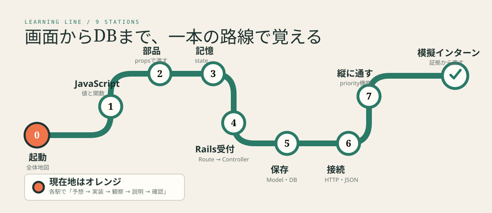
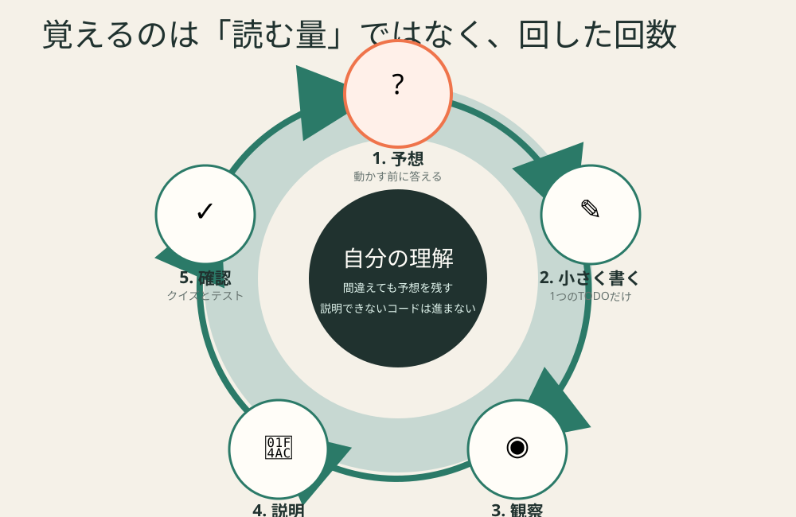

# React × Rails はじめての実務ハンズオン



> **読むだけの教材ではありません。** 予想する → 1か所だけ書く → 画面で確かめる → クイズに答える → 自分の言葉で説明する、を繰り返します。

ReactもRailsも初めてで、プログラミング用語にもまだ慣れていない人が、インターンで既存コードへ入る前に使う練習場です。

完成品は「Task Bridge」という小さなタスク帳です。追加ボタンを押したとき、処理が次の順に進むことを、画面・コード・Network・Railsログで確かめます。

```text
Reactの入力欄
  ↓ クリック
Reactの関数
  ↓ HTTP通信
RailsのRoute → Controller → Model → DB
  ↓ JSONで返事
Reactのstateが変わる
  ↓
画面が描き直される
```

## 最初にやること

### 1. 取得

```bash
git clone https://github.com/sota411/react-rails.git
cd react-rails
```

### 2. 起動

Dockerが使える場合:

```bash
docker compose up --build
```

起動後:

- React画面: `http://localhost:5173`
- Rails確認用API: `http://localhost:3000/api/v1/health`
- 操作できる図解: `docs/visual-lab/index.html`

Dockerを使わない起動方法は [Lesson 0](docs/lessons/00-start.md) にあります。

### 3. Codexを先生役で開始

Codexへ送る文章:

```text
このリポジトリの AGENTS.md と PROGRESS.md を読んでください。
Lesson 0を先生役として開始してください。
最初はコードを変更せず、確認問題を1つだけ出してください。
英語の技術用語には、その場で短い日本語の意味を添えてください。
```

## 毎回同じ学習ループ



1. **予想する**: 実行前に何が起きるか言う
2. **小さく書く**: 1回につき1つのTODOだけ直す
3. **観察する**: 画面、Console、Network、Railsログを見る
4. **説明する**: 「何を受け取り、何をし、何を返したか」を言う
5. **確認する**: クイズと自動テストを通す

答えを先に見るより、予想が外れた理由を確認する方を重視します。

## コース

| Lesson | 手を動かして確かめるもの | 主な新語 |
|---|---|---|
| [0. 全体地図と起動](docs/lessons/00-start.md) | 画面・API・ログを同時に開く | frontend、backend、API |
| [1. JavaScriptの最低限](docs/lessons/01-javascript.md) | 配列から未完了taskを取り出す | 変数、配列、関数 |
| [2. Reactの部品](docs/lessons/02-react-components.md) | 件数表示をComponentへ分ける | JSX、Component、props |
| [3. Reactが覚える仕組み](docs/lessons/03-react-state.md) | クリックで説明表示を変える | state、event、再描画 |
| [4. Railsが受付する仕組み](docs/lessons/04-rails-request.md) | stats APIをtestから作る | Route、Controller、JSON |
| [5. Railsが保存する仕組み](docs/lessons/05-rails-database.md) | DB保存と失敗を観察する | Model、migration、validation |
| [6. ReactとRailsをつなぐ](docs/lessons/06-connect.md) | GET・POSTの往復を追う | HTTP、fetch、status |
| [7. 機能を縦に通す](docs/lessons/07-priority-feature.md) | priorityをDBから画面まで追加 | strong parameters、縦断実装 |
| [8. 模擬インターン](docs/lessons/08-debug-internship.md) | 故障を証拠から切り分ける | Console、Network、log、PR |

時間が少ない場合は **0 → 2 → 3 → 4 → 6 → 8** の順で進めます。毎日の進め方は [インターン前の7日間プラン](docs/7-day-plan.md) にあります。

## 理解度クイズ

Lesson 0〜8に各4問、合計36問あります。Terminalで回答すると、その場で理由付き採点が出ます。

```bash
node scripts/quiz.mjs --list
node scripts/quiz.mjs 2
```

`2` はLesson 2です。80%未満でも失敗ではなく、間違えた理由を `PROGRESS.md` へ言い直します。

進捗確認:

```bash
node scripts/progress.mjs
```

## コードを1行ずつ読む

「コードがあるだけ」にならないよう、実際のファイルを番号付きで分解しています。

- [コードを読む順番](docs/code-tour/README.md)
- [Reactの入口から画面まで](docs/code-tour/01-react-app.md)
- [入力フォーム](docs/code-tour/02-task-form.md)
- [fetchによる通信](docs/code-tour/03-api-client.md)
- [RailsのRoute→Controller](docs/code-tour/04-rails-controller.md)
- [Model・migration・DB](docs/code-tour/05-model-database.md)

各コード片は次の3点で説明します。

1. 何を受け取るか
2. 何をするか
3. 何を次へ渡すか

## 視覚で理解する

### 実際のReact画面

Task Bridgeには「処理のX線モード」があります。追加・更新・削除を行うと、現在地が次の順に動きます。

```text
React → HTTP → Rails + DB → JSON → state
```

### 操作できる図解

`docs/visual-lab/index.html` をブラウザで開きます。

- 1段階ずつ再生
- 自動再生
- 実際の技術名とレストラン比喩の切り替え
- 各段階の実コード
- 先へ進む前の確認問題

### 静止画

- [コースマップ](docs/visuals/00-course-map.svg)
- [レストランに見立てたrequestの流れ](docs/visuals/02-request-restaurant.svg)
- [state変更前後](docs/visuals/03-react-state-before-after.svg)
- [NetworkとRailsログの対応](docs/visuals/04-network-log-xray.svg)
- [priority機能の縦断面](docs/visuals/05-priority-vertical-slice.svg)
- [バグ調査で見る4つの窓](docs/visuals/06-debug-four-windows.svg)

## わざと壊して調べる

安全に故障を適用・復元するscriptがあります。

```bash
node scripts/bug-lab.mjs --list
node scripts/bug-lab.mjs 404-path --apply
node scripts/bug-lab.mjs 404-path --revert
```

用意した故障:

- API pathのtypoによる404
- 空title送信による422
- `done` が保存されないstrong parameters不具合
- responseの形が変わってReactが落ちる不具合

修正前に、画面 → Console → Network → Railsログ → DBの順で証拠を集めます。

## 演習と解答

```text
exercises/  自分で埋めるTODO、test、設計用紙、障害記録
solutions/  解答例。自分の実装と説明が終わるまで見ない
```

JavaScript演習は、最初はtestが失敗する状態です。

```bash
node --test exercises/01-javascript/tasks.test.mjs
```

TODOを1つ直すたびに再実行します。

## Codexを答え製造機にしない

| モード | Codexがしてよいこと | してはいけないこと |
|---|---|---|
| `coach` | 質問、図解、ヒント、用語説明 | コード変更、完成解の提示 |
| `pair` | 説明済みのTODOを1つだけ編集 | 複数ファイルを一気に完成 |
| `reviewer` | 差分レビュー、test、原因候補整理 | 代わりに修正 |
| `implementer` | 最終課題で合意済み設計を実装 | 未説明の設計変更、依存追加 |

現在のモードは [PROGRESS.md](PROGRESS.md) で変えます。詳細は [Codex学習ハーネス](docs/codex/learning-harness.md)、開始文は [CODEX_START.md](CODEX_START.md) にあります。

Codexはリポジトリ階層ごとの `AGENTS.md` を読みます。

```text
AGENTS.md             全体の先生ルール
frontend/AGENTS.md    Reactを教える追加ルール
backend/AGENTS.md     Railsを教える追加ルール
exercises/AGENTS.md   答えを先に出さないルール
solutions/AGENTS.md   解答を見る条件
```

## リポジトリの見取り図

```text
react-rails/
├── frontend/              動くReact画面
├── backend/               動くRails APIとSQLite DB
├── exercises/             手を動かす問題
├── solutions/             隔離した解答例
├── docs/lessons/          Lesson 0〜8
├── docs/code-tour/        実コードの逐行解説
├── docs/visuals/          GitHub上で見られる図解
├── docs/visual-lab/       操作できるデータの旅
├── quiz/                  36問の問題データ
├── scripts/               採点・進捗・故障注入・構造確認
├── AGENTS.md              Codex全体ルール
└── PROGRESS.md            学習者本人が更新する進捗
```

## インターン前の完成条件

全構文を暗記する必要はありません。次ができれば、既存コードへ入りやすくなります。

- ボタンを押したとき、最初に動くfunctionを探せる
- `props` と `state` を「渡された値」「画面が覚える値」と言い分けられる
- URLからRailsのRouteとControllerを探せる
- Networkのstatusが404・422・500のどれか確認できる
- 「どの層まで正常か」を証拠付きで説明できる
- Codexへ丸投げせず、予想・設計・観察結果を渡して相談できる

## 想定バージョン

完成アプリはReact 19系・Vite 8系・Rails 8.1系を想定しています。インターンでは、この教材より**会社のリポジトリに固定されたversion・命名・test方式を優先**してください。

## 自動確認

Pull Requestでは次をCIで確認します。

- 教材ファイルとquiz JSONの構造
- Reactのtestとproduction build
- RailsのModel・Controller test

演習用の意図的に失敗するtestはCIへ含めません。

## 参考資料

- React公式 Learn: https://react.dev/learn
- Rails公式 Getting Started: https://guides.rubyonrails.org/getting_started.html
- Rails公式 API-only Applications: https://guides.rubyonrails.org/api_app.html
- Codex公式 AGENTS.md: https://developers.openai.com/codex/guides/agents-md
- 学習ハーネス設計の着想: https://qiita.com/WdknWdkn/items/fe4b1810f45e4b6df166
