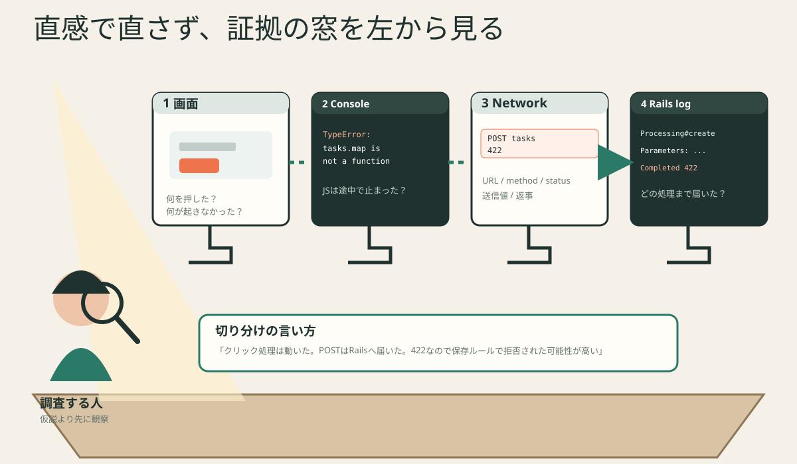

# デバッグ早見表



## 最初の一文

修正前に、次を埋めます。

```text
操作:
期待:
実際:
最後に正常だと確認できた場所:
```

## 4つの窓

### 1. 画面

- どのボタンを押したか
- 入力した文字は何か
- 読み込み中表示は出たか
- エラー表示は出たか

### 2. Console

赤い行のうち、最初に自分たちのファイル名が出る場所を見ます。

```text
TypeError: tasks.map is not a function
at TaskList (TaskList.jsx:12)
```

この場合、まず `TaskList.jsx:12` と、`tasks` の実際の値を確認します。

### 3. Network

対象の通信を選びます。

| 見る項目 | 質問 |
|---|---|
| Name / path | 期待するURLか |
| Method | GET・POST・PATCH・DELETEのどれか |
| Status | 2xx・404・422・500のどれか |
| Payload | 送信JSONに必要な値があるか |
| Response | Railsは何を返したか |

### 4. Railsログ

```text
Started POST "/api/v1/tasks"
Processing by Api::V1::TasksController#create
Parameters: {"task"=>{"title"=>"読む"}}
Completed 201 Created
```

この4行から、URL、Controller、入力値、結果番号を確認できます。

## 結果番号から最初に疑う場所

| status | 意味 | 最初に見る場所 |
|---:|---|---|
| 200 | 成功 | responseの形が画面の期待と合うか |
| 201 | 新規作成成功 | stateへ追加したか |
| 204 | 成功、返す本文なし | `response.json()` を呼んでいないか |
| 404 | 届け先または対象がない | path、Route、id |
| 422 | 値を受け取ったが保存ルールに通らない | Payload、validation、errors |
| 500 | Rails内部で例外 | Railsログ最初の自分のファイル |

## 質問テンプレート

```text
POST /api/v1/tasks を送ろうとしました。
Networkでは422で、Responseは title can't be blank でした。
RailsログではTasksController#createまで到達しています。
TaskFormから送るtitleが空になる経路を一緒に確認したいです。
```

「動きません」だけより、相手がすぐ同じ場所を見られます。
