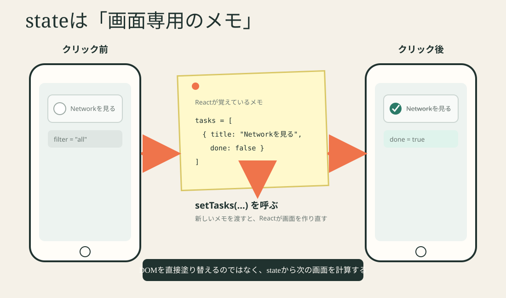

# Lesson 3 — Reactが覚える仕組み



## 今日の完成物

TaskFormの説明文を、ボタンで表示・非表示にします。

```text
［説明を隠す］
入力中の文字はReactのstate、追加後はDBに保存されます。
```

ここではRailsへ通信しません。Reactだけで画面が変わる経験を作ります。

## 0. 先に予想

次のうち、画面が描き直されるきっかけになるのはどれでしょう。

```text
A. 普通の変数を書き換える
B. setStateに新しい値を渡す
C. コメントを書く
```

## 1. stateは画面用のメモ

`frontend/src/components/TaskForm.jsx`:

```jsx
const [title, setTitle] = useState("");
```

3つに分けます。

| 部分 | 意味 |
|---|---|
| `title` | 現在覚えている値 |
| `setTitle` | 新しい値へ変えるためのfunction |
| `useState("")` | 最初は空文字で覚える |

入力が起きるたび:

```jsx
onChange={(event) => setTitle(event.target.value)}
```

```text
キーボード入力
  ↓ onChange event
入力欄の現在値を読む
  ↓ setTitle
stateが変わる
  ↓
value={title} を使って画面を描き直す
```

## 2. propsとstateを区別する

| 質問 | props | state |
|---|---|---|
| 誰が値を用意する？ | 親Component | そのComponent |
| 自分で直接変える？ | 変えない | setterで変える |
| TaskFormの例 | `onAdd`, `disabled` | `title` |

迷ったら「この値の持ち主は誰か」を考えます。

## 3. 手を動かす: 説明を開閉する

対象:

```text
frontend/src/components/TaskForm.jsx
```

### Step 1 — stateを増やす

日本語コメントから書きます。

```jsx
// 説明文を表示するか覚える。最初は表示する
```

必要な形:

```jsx
const [showHint, setShowHint] = useState(true);
```

`true` は表示、`false` は非表示と決めます。

### Step 2 — eventの入口を作る

buttonを追加します。

```jsx
<button type="button" onClick={...}>
  説明を隠す
</button>
```

`type="button"` が重要です。formの中で省略すると、追加のsubmitとして扱われることがあります。

クリック時の考え方:

```text
現在true  → falseへ
現在false → trueへ
```

JavaScriptでは `!showHint` で反対のbooleanを作れます。

### Step 3 — 条件付き表示

現在の説明文:

```jsx
<p className="task-form__hint">...</p>
```

`showHint` がtrueのときだけ表示します。

```jsx
{showHint && (
  <p className="task-form__hint">...</p>
)}
```

`&&` はこの場面では「左がtrueなら右を使う」と読みます。

### Step 4 — ボタンの文字も変える

```jsx
{showHint ? "説明を隠す" : "説明を表示"}
```

`条件 ? trueのとき : falseのとき` は三項演算子です。ここでは2択の表示にだけ使います。

## 4. 観察する

1. 説明を隠す
2. 入力欄の文字が消えないことを確認
3. もう一度押して表示
4. Consoleにエラーがないことを確認

### なぜ入力文字は消えない？

`showHint` と `title` は別々のstateだからです。片方を変えても、もう片方の値は維持されます。

## 5. stateに入れなくてよい値

`counts.done` は `tasks` から計算できます。

```jsx
const counts = countTasks(tasks);
```

元になるstateから毎回計算できるなら、同じ情報を別のstateへ重複して持たない方がずれにくくなります。

## よくある間違い

### setterを呼ばず代入

```jsx
showHint = false; // Reactは変更として扱えない
```

### eventでfunctionを呼び終えた結果を渡す

```jsx
onClick={setShowHint(false)} // 描画中に実行される
```

クリック時に実行するfunctionを渡します。

```jsx
onClick={() => setShowHint(false)}
```

## 理解度クイズ

```bash
node scripts/quiz.mjs 3
```

## Codexへ送る

```text
showHintの実装をレビューしてください。コードは変更しないでください。
クリック前後で、どのstateがどう変わり、JSXのどこが変わるかを
私に説明させる質問を1つ出してください。
```

## 完了条件

- [ ] 説明の表示・非表示を切り替えられる
- [ ] title stateは維持される
- [ ] propsとstateの持ち主を説明できる
- [ ] setterを呼ぶと再描画されると説明できる
