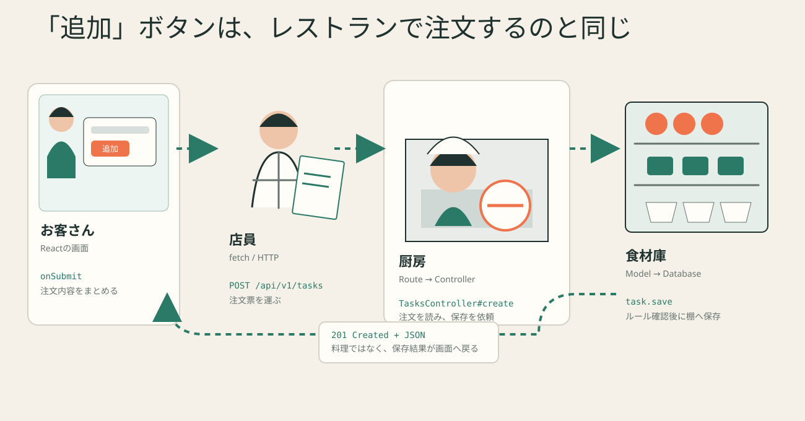

# Lesson 4 — Railsが受付する仕組み



## 今日の完成物

新しい入口を作ります。

```text
GET /api/v1/stats
```

返すJSON:

```json
{
  "all": 3,
  "done": 1,
  "active": 2
}
```

RouteとControllerを別々に作り、どこまで届いたかを確認します。

## 0. Railsを店として見る

| レストラン | Rails |
|---|---|
| 住所と注文種類 | method + path |
| 席へ案内する表 | Route |
| 注文を受ける店員 | Controller |
| 食材ルール | Model |
| 食材庫 | Database |
| 完成した伝票 | JSON response |

比喩は入口です。最終的には実際のファイル名で説明します。

## 1. 既存health APIを追う

ブラウザ:

```text
http://localhost:3000/api/v1/health
```

### Route

`backend/config/routes.rb`:

```ruby
get "health", to: "health#show"
```

分解:

```text
GET             依頼の種類
/api/v1/health  namespaceを含む届け先
health          HealthController
show            呼ばれるmethod
```

### Controller

`backend/app/controllers/api/v1/health_controller.rb`:

```ruby
def show
  render json: { status: "ok", message: "Rails API is running" }
end
```

```text
受け取る: GET /api/v1/health
行う:     JSONにする値を用意
返す:     statusとmessage
```

## 2. Route一覧を機械に聞く

```bash
cd backend
bin/rails routes
```

`api_v1_health` と `api_v1_tasks` を探します。

大量に出る場合:

```bash
bin/rails routes | grep api_v1
```

## 3. 手を動かす: stats API

### Step 1 — 先にテストを書く

作成:

```text
backend/test/controllers/api/v1/stats_controller_test.rb
```

テストで確認したいこと:

```text
GET /api/v1/stats を送る
  ↓
成功する
  ↓
all / done / active がJSONにある
```

最初は失敗して構いません。まだRouteがないため404になります。

```bash
bin/rails test test/controllers/api/v1/stats_controller_test.rb
```

### Step 2 — Routeだけ追加

`backend/config/routes.rb` の `namespace :v1` 内:

```ruby
get "stats", to: "stats#show"
```

もう一度テストします。今度はControllerがないエラーへ変わるはずです。

> エラーが変わったのは前進です。Routeまでは通った証拠です。

### Step 3 — Controllerを作る

作成:

```text
backend/app/controllers/api/v1/stats_controller.rb
```

最初は固定値で返します。

```ruby
module Api
  module V1
    class StatsController < ApplicationController
      def show
        render json: { all: 0, done: 0, active: 0 }
      end
    end
  end
end
```

テストがControllerへ届くことを確認します。

### Step 4 — 実データを数える

使える処理:

```ruby
Task.count
Task.where(done: true).count
Task.where(done: false).count
```

固定値をこの3つへ置き換えます。

### Step 5 — ブラウザで確認

```text
http://localhost:3000/api/v1/stats
```

Task Bridgeで1件完了状態を変え、再度開き、数が変わることを確認します。

## 4. requestとresponse

```text
Request
  method: GET
  path:   /api/v1/stats
  body:   なし

Response
  status: 200
  body:   { all: ..., done: ..., active: ... }
```

GETはデータを読む依頼なので、通常はrequest bodyを使いません。

## 5. 404を読めるようにする

次へアクセスします。

```text
http://localhost:3000/api/v1/statssss
```

404は「Rails全体が壊れた」ではなく、まず「そのmethod + pathに一致するRouteがない」と考えます。

## よくある間違い

### namespaceの外へ書く

`/api/v1/stats` にしたいなら、2つのnamespace内へ置きます。

### Controllerのファイル場所が違う

```text
app/controllers/api/v1/stats_controller.rb
```

moduleの入れ子とディレクトリが対応します。

### `render` を書かない

API Controllerは、何をresponseとして返すか明示します。

## 理解度クイズ

```bash
node scripts/quiz.mjs 4
```

## Codexへ送る

```text
Lesson 4のstats APIを作ります。まだ実装しないでください。
GET /api/v1/stats が、RouteからどのController methodへ届くべきか、
私に穴埋め問題として出してください。
```

## 完了条件

- [ ] stats testが成功
- [ ] ブラウザでJSONを確認
- [ ] Routeを「method + pathとControllerを結ぶ表」と説明できる
- [ ] 404時に最初にroutesを確認できる
