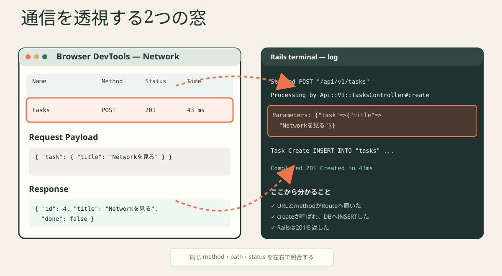

# Lesson 6 — ReactとRailsをつなぐ



## 今日の完成物

1件の追加を、次の6つの証拠で説明します。

```text
1. Reactのevent
2. fetchのmethod / path / body
3. Networkのrequest
4. RailsログのController
5. Networkのresponse
6. setTasks後の画面
```

コードを増やすより、「既に動いている一本を追えること」が目的です。

## 0. CRUDとHTTP method

| 操作 | 英語 | method | このアプリ |
|---|---|---|---|
| 作る | Create | POST | task追加 |
| 読む | Read | GET | task一覧 |
| 変える | Update | PATCH | 完了切替 |
| 消す | Delete | DELETE | task削除 |

CRUDは4操作の頭文字です。最初は表を見ながらで構いません。

## 1. POSTの入口を追う

### TaskForm

```jsx
<form onSubmit={handleSubmit}>
```

`handleSubmit` が `onAdd(trimmedTitle)` を呼びます。

### App

```jsx
<TaskForm onAdd={handleAdd} />
```

親の `handleAdd` がpropsとして子へ渡されています。

### API client

```jsx
const newTask = await createTask(title, ...);
```

`frontend/src/api/tasks.js`:

```js
fetch("/api/v1/tasks", {
  method: "POST",
  headers: { "Content-Type": "application/json" },
  body: JSON.stringify({ task: { title } }),
});
```

## 2. JSONの外側にtaskがある理由

送信:

```json
{
  "task": {
    "title": "Networkを見る"
  }
}
```

Rails:

```ruby
params.require(:task).permit(:title, :done)
```

対応:

```text
require(:task)       → 外側の "task"
permit(:title,:done) → 内側で受け取ってよい項目
```

外側の `task` を消すと、Controllerの期待する形と合いません。

## 3. 実際に一往復を記録する

Chrome DevToolsのNetworkを開き、ログを消してから1件追加します。

### Networkで記録

```text
Method:
Path:
Status:
Request Payload:
Response:
```

### Railsログで記録

```text
Started:
Processing by:
Parameters:
SQL:
Completed:
```

左右でmethod・path・statusが一致することを確認します。

## 4. statusの読み方

| 範囲 | 大まかな意味 | 例 |
|---:|---|---|
| 2xx | 成功 | 200, 201, 204 |
| 4xx | request側の条件に問題 | 404, 422 |
| 5xx | server内部で失敗 | 500 |

### このアプリ

| 操作 | 成功status | response body |
|---|---:|---|
| 一覧取得 | 200 | task配列 |
| 追加 | 201 | 作成したtask |
| 更新 | 200 | 更新したtask |
| 削除 | 204 | なし |

204では本文がないため、`response.json()` を呼ぶと失敗します。`deleteTask` がJSONを読まない理由です。

## 5. 手を動かす: 404を作って直す

安全に故障を入れるscriptを使います。

```bash
node scripts/bug-lab.mjs 404-path --apply
```

React画面で再読み込みします。

### 修正する前に観察

- Consoleには何が出たか
- Networkのpathは何か
- statusは何か
- RailsログにController名は出たか

予想される切り分け:

```text
Reactのfetchまでは動いた。
/api/v1/taskzへGETが出て404だった。
TasksController#indexは呼ばれていない。
pathの誤りを疑う。
```

元へ戻す:

```bash
node scripts/bug-lab.mjs 404-path --revert
```

> 先にファイルを探して直すのではなく、証拠から故障層を決める練習です。

## 6. PATCHを追う

完了チェックを押し、NetworkでPATCHを選びます。

送信body:

```json
{
  "task": {
    "done": true
  }
}
```

pathにはidが入ります。

```text
/api/v1/tasks/4
```

Railsは `params[:id]` から対象taskを探します。

## 7. DELETEを追う

削除を押します。

```text
DELETE /api/v1/tasks/:id
status 204
response bodyなし
```

画面側では、成功後に次を行います。

```js
currentTasks.filter((task) => task.id !== taskId)
```

DBから消した後、stateの配列からも同じidを外します。

## 8. 通信が2回見える場合

開発中、ReactのStrictModeなどにより処理確認のため一部の実行が増えることがあります。まず「本番でも必ず2回」と決めつけず、どのeventやEffectから呼ばれたかを確認します。

この教材の `main.jsx` は初学者が通信を追いやすいよう、StrictModeで包んでいません。会社のRepoでは勝手に外さず、既存設定を優先してください。

## 理解度クイズ

```bash
node scripts/quiz.mjs 6
```

## Codexへ送る

```text
NetworkとRailsログの記録を貼ります。
まだ修正せず、どの層まで正常かを1文にまとめ、
次に見る場所を1つだけ提案してください。

記録:
（ここへ貼る）
```

## 完了条件

- [ ] POSTの6つの証拠を記録した
- [ ] 404故障を観察して戻した
- [ ] PATCHのidとbodyを確認した
- [ ] DELETEの204に本文がないと説明できる
- [ ] 404・422・500の最初の確認場所を言える
