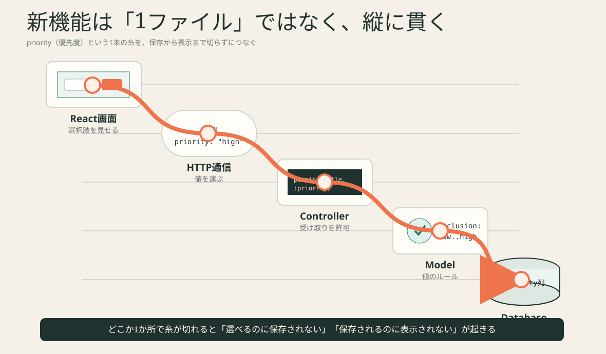

# Lesson 7 — priority機能を縦に通す



## 最終課題

タスクへpriority（優先度）を追加します。

```text
low    低
normal 通常
high   高
```

## 受け入れ条件

完成は「画面に選択肢が出た」だけではありません。

- [ ] 作成時にlow / normal / highを選べる
- [ ] 未指定ならnormalになる
- [ ] DBへ保存される
- [ ] 再読み込み後も同じpriorityが表示される
- [ ] 不正な値は422になる
- [ ] Model testとController testがある
- [ ] 既存の追加・完了・削除が壊れていない

## 0. 実装前の縦断設計

`exercises/07-priority/design.md` を埋めます。

| 層 | 入力 | 変更 | 出力 | 確認方法 |
|---|---|---|---|---|
| DB | migration | priority列 | 保存済み値 | schema / console |
| Model | priority | 値のvalidation | valid / errors | model test |
| Controller | request params | permitへ追加 | JSON / 422 | controller test |
| API client | title, priority | JSON body | task | Network |
| React form | select操作 | priority state | onAddへ渡す | 画面 |
| React item | task.priority | badge表示 | JSX | 再読み込み |

この表を自分で埋めるまで、Codexを `implementer` にしません。

## 1. DBへ列を追加

生成:

```bash
cd backend
bin/rails generate migration AddPriorityToTasks priority:string
```

生成されたmigrationへ、defaultとnull制約を追加します。

考える値:

```text
default: "normal"
null: false
```

実行:

```bash
bin/rails db:migrate

git diff db/schema.rb
```

schemaで確認:

```text
priority列がある
string型
null: false
default: "normal"
```

### checkpoint

```bash
bin/rails console
Task.create!(title: "優先度を確認").priority
# => "normal"
```

ここで画面はまだ変わりません。それで正常です。

## 2. Modelへルールを追加

許可する値を1か所に置きます。

```ruby
PRIORITIES = %w[low normal high].freeze
```

validationの考え方:

```text
priorityがPRIORITIESの中に含まれること
```

先にtestを書きます。

```text
normalは有効
urgentは無効
```

実行:

```bash
bin/rails test test/models/task_test.rb
```

### checkpoint

`urgent` がerrorsへ入ることをconsoleで確認します。

## 3. Controllerで受け取りを許可

現在:

```ruby
params.require(:task).permit(:title, :done)
```

priorityを送っても、ここで許可しなければ捨てられます。

変更後の観点:

```text
permitへpriorityがあるか
```

Controller testへ追加:

```text
priority: "high" でPOST
responseのpriorityがhigh
DB上もhigh
```

不正値test:

```text
priority: "urgent" でPOST
status 422
```

## 4. curlでbackendだけ確認

Reactを変える前に、Rails API単体で確認します。

```bash
curl -i \
  -X POST http://localhost:3000/api/v1/tasks \
  -H 'Content-Type: application/json' \
  -d '{"task":{"title":"重要な確認","priority":"high"}}'
```

成功条件:

```text
201
JSONに "priority":"high"
```

ここまで通れば、DB・Model・Controllerはつながっています。

## 5. API clientへ値を通す

現在:

```js
export async function createTask(title, reportStage) {
```

変更後はpriorityも受け取ります。

```text
createTask(title, priority, reportStage)
```

request body:

```json
{
  "task": {
    "title": "重要な確認",
    "priority": "high"
  }
}
```

NetworkのPayloadで確認します。画面表示だけで判断しません。

## 6. TaskFormへselectを追加

新しいstate:

```text
priorityの最初の値はnormal
```

selectの完成イメージ:

```text
優先度 [ 通常 ▼ ]
```

option:

```text
low    低
normal 通常
high   高
```

`onAdd` へtitleとpriorityを渡します。追加成功後、titleは空へ戻し、priorityをnormalへ戻すかどうかを自分で決め、理由を設計メモへ書きます。

## 7. AppのhandleAddをつなぐ

現在の経路:

```text
TaskForm → handleAdd(title) → createTask(title)
```

目標:

```text
TaskForm → handleAdd(title, priority)
         → createTask(title, priority)
```

途中のどこかで引数を落とすと、NetworkのPayloadからpriorityが消えます。

## 8. TaskItemにbadgeを表示

例:

```text
[高] 重要な確認
[通常] Networkを見る
[低] 用語集を読む
```

表示用の対応表をComponent外へ置けます。

```js
const priorityLabels = {
  low: "低",
  normal: "通常",
  high: "高",
};
```

色だけで区別せず、必ず文字も表示します。

## 9. 再読み込みtest

1. highで追加
2. NetworkのPOST responseを確認
3. ページ再読み込み
4. GET responseを確認
5. badgeがhighのままか確認

この手順で「Reactのstateに一時表示しただけ」ではなく、DB保存されたことを確認できます。

## 10. 実装後のreview

Codexを `reviewer` へ戻します。

```text
priority機能のgit diffをレビューしてください。コードは変更しないでください。
次の観点に分けてください。
- DBから画面まで値が途切れていないか
- 不正値のtestがあるか
- 既存機能への影響
- 私に説明させる質問3つ
```

## 詰まったときの切り分け

| 症状 | 最初に見る場所 |
|---|---|
| selectはあるがPayloadにない | TaskForm → handleAdd → createTaskの引数 |
| Payloadにあるがresponseはnormal | Controllerのpermit |
| 422になる | Model validationと送信文字 |
| responseにあるがbadgeがない | TaskItemのpropsと表示 |
| 表示されるが再読込で戻る | DB列・保存・GET response |

## 理解度クイズ

```bash
node scripts/quiz.mjs 7
```

## 完了条件

- [ ] 受け入れ条件を全て確認
- [ ] `bin/rails test` 成功
- [ ] `npm test` 成功
- [ ] NetworkでPOSTとGETのpriorityを確認
- [ ] 縦断設計を自分の言葉で説明

解答例は `solutions/07-priority/` にあります。自分の実装を完了し、diffを説明できるまで開かないでください。
